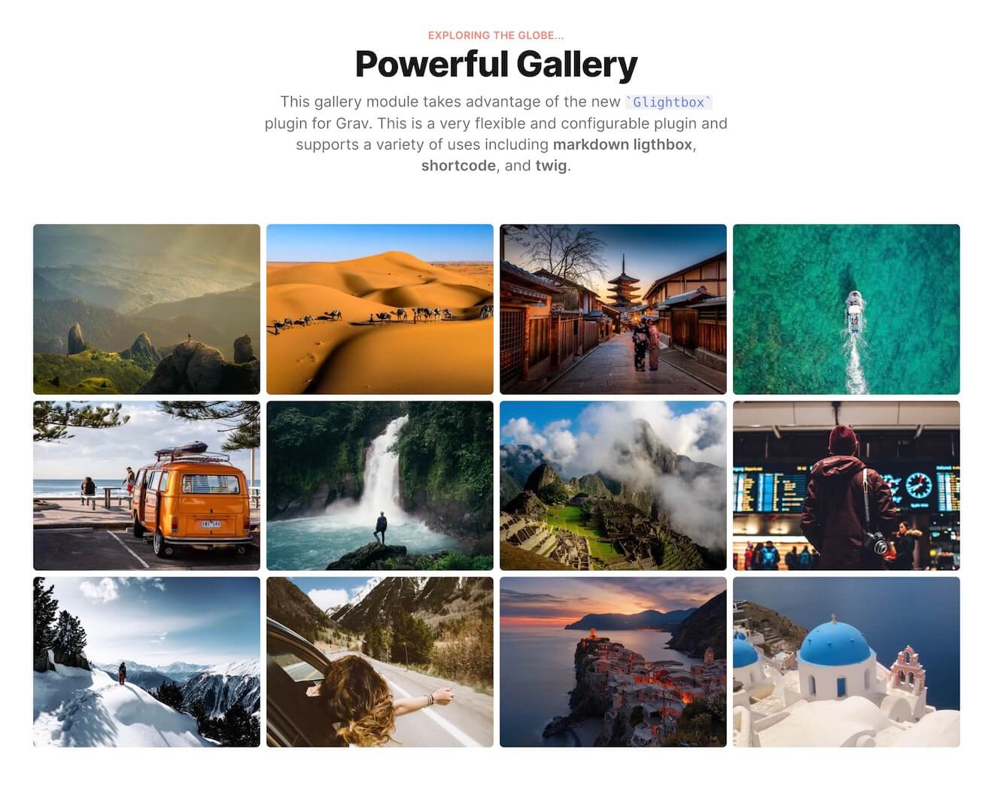

# Lightbox Gallery Plugin

The **Lightbox Gallery** Plugin is an extension for [Grav CMS](http://github.com/getgrav/grav) providing A lightweight but flexible lightbox implementation based on the fantastic [GLightbox Library](https://biati-digital.github.io/glightbox). This plugin provides custom grav shortcodes as well as Twig partial that can be used directly or in a gallery template. An example of a gallery can be seen in the Typhoon Grav theme with the `modular/gallery.html.twig` template.

### Features

- **Small** - only 11KB Gzipped
- **Framework Agnostic** - No jQuery or other JavaScript framework required.
- **Fast and Responsive** - works with any screen size
- **Gallery Support** - Create multiple galleries
- **Video Support** - Youtube, Vimeo and self hosted videos with autoplay
- **Inline content support** - display any inline content
- **Iframe support** - need to embed an iframe? no problem
- **Keyboard Navigation** - esc, arrows keys, tab and enter is all you need
- **Touch Navigation** - mobile touch events
- **Zoomable images** - zoom and drag images on mobile and desktop
- **API** - control the lightbox with the provided methods
- **Themeable** - create your skin or modify the animations with some minor css changes

## Important Links

* [Lightbox Gallery Documentation](https://getgrav.org/premium/lightbox-gallery/docs)
* [Lightbox Gallery Details](https://getgrav.org/premium/lightbox-gallery)

## Credits

* [Bati Digital for their amazing Lightbox Gallery script](https://biati-digital.github.io/glightbox)

